# HTTP

## 03 浏览器发起 HTTP 请求的场景

* 浏览器发起 HTTP 请求的场景

	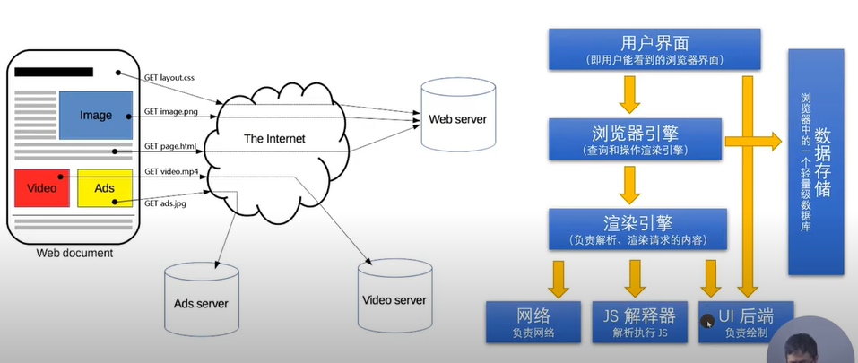

	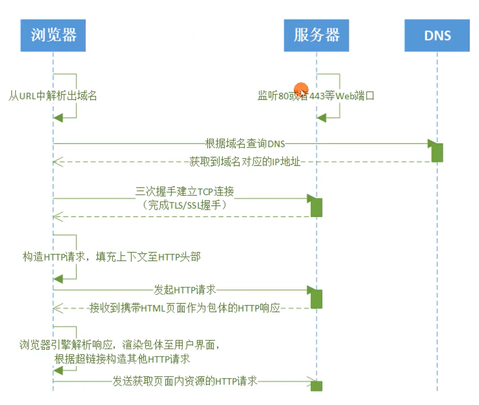

* Hypertext Transform Protocol (HTTP)

	a ***stateless*** (无状态协议，连续的两个请求中，后一个请求不能依赖前一个请求的字段或者头部等)

	application-level ***request/resonse*** (基于一个连接，由客户端发起请求，然后服务器才能在这个连接上发起一个响应)

	protocol that uses ***extensible semantics*** (语义是可扩展的，如果服务器只支持 1.0, 但浏览器支持 1.1，两者仍然可以正常通信)

	and ***self-descriptive** (子描述的消息，从请求中就知道这段消息是视频还是音频等，而不需要依赖其他的请求)

	message payloads of flexible interaction with network-based ***hypertext information*** (超文本系统，传输的不止有文档, 还有图片等)


	systems

	(RFC7230 2014.6)

## 04 基于 ABNF 语义定义的 HTTP 消息格式

* ABNF (扩充巴科斯-瑙尔范式) 操作符 (定义语法的元语言)
	* 空白字符：用来分隔定中的各个元素, 并不是表达描述的协议中有空白
		* method SP request-target SP HTTP-version CRLF
			* SP 是空格
			* SP 两边的空格不是
	* 选择 /: 表示多个规则都是可供选择的规则
		* start-line = request-line / status-line
	* 值范围 %c##-##:
		* OCTAL = "0" / "1" / "2" / "3" / "4" / "5" / "6" / "7" 与 OCTAL = %x30-37 (十六进制中的 30 到 37) 等价
	* 序列组合 (): 将规则组合起来，视为单个元素
	* 不定量重复 m*n
		* \* 元素表示零个或更多元素： *( header-field CRLF)
		* 1* 元素表示一个或更多元素， 2*4 元素表示两个至四个元素
	* 可选序列 [];
		* [ message-body ]
* ABNF 核心规则

	|规则|形式定义|意义|
	|-|-|-|
	|ALPHA|%x41-5A / %x61-7A|大写和小写 ASCII 字母 (A-Z, a-z)|
	|DIGIT|%x30-39|数字 (0 - 9)|
	|HEXDIG|DIGIT / "A" / "B" / "C" / "D" / "E" / "F"|十六进制数字 (0-9, A-F, a-f|
	|DQUOTE|%x22|双引号|
	|SP|%x22|空格|
	|HTAB|%x09|横向制表符|
	|WSP|SP / HTAB|空格或横向制表符|
	|LWSP|*(WSP/CRLF WSP)|直线空白（晚于换行）|
	|VCHAR|%x21-7E|可见（打印）字符|
	|CHAR|%x01-7F|任何7-位US-ASCII字符，不包含NUL (%x00)|
	|OCTET|%x00-FF/ %x7F|八位数据|
	|CTL|%x00-1F/ %x7F|控制字符|
	|CR|%x0D|回车|
	|LF|%x0A|换行|
	|CRLF|CRLF|互联网标准换行|
	|BIT|"0" / "1"|二进制数字|

* 基于 ABNF 描述的 HTTP 协议格式

HTTP-message = start-line *(header-filed CRLF) CRLF [ message-body ]
* start-line = request-line / status-line
	* request-line = method SP request-target SP HTTP-version CRLF
	* status-line = HTTP-version SP status-code SP reason-phrase CRLF
* header-field = field-name ":" OWS field-value OWS
	* OWS = *(SP / HTAB)
	* field-name = token
	* field-value = *(field-content / obs-fold)
* message-body = *OCTET
* 实验
	* telnet

		

	* Wireshark

## 05 网络为什么要分层： OSI 模型与 TCP IP 模型

* OSI (Open System Interconnection Reference Model) 概念模型

	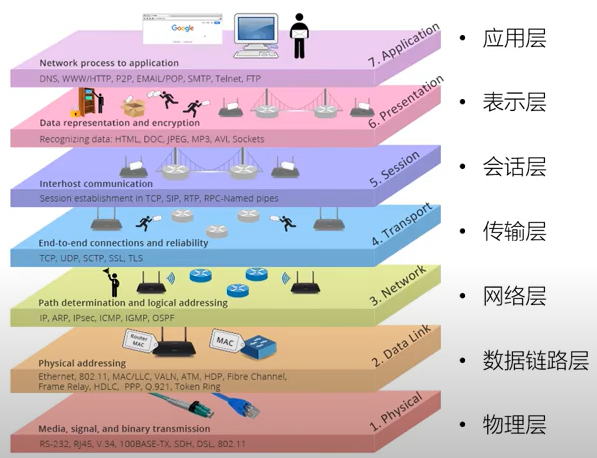

	```
	7. Application
		* 解决业务问题
	6. Presentation
		* 把网络中的消息，转换成应用层可以读取的格式 (TSL, SSL)
	5. Session (上下层都有延申的这里，只是个概念)
		* 建立会话，握手，维持连接关系
	4. Transport
		* 进程与进程之间的通信
			* 报文发到主机上，主机因该把报文分发给哪一个进程，由传输层来决定
		* 保证报文的可达性 (TCP)
		* 流量的控制 (TCP)
		* 负载均衡
	3. Network
		* 在广域网中，可以从一个主机上把报文发送到另外一个主机上 (IP)
	2. Data Link
		* 在局域网中，使用 MAC 地址连接到响应的交换机或者路由器
		* 二层设备
	1. Physical 
		* 物理介质
	```

* OSI 模型与 TCP/IP 模型对照

	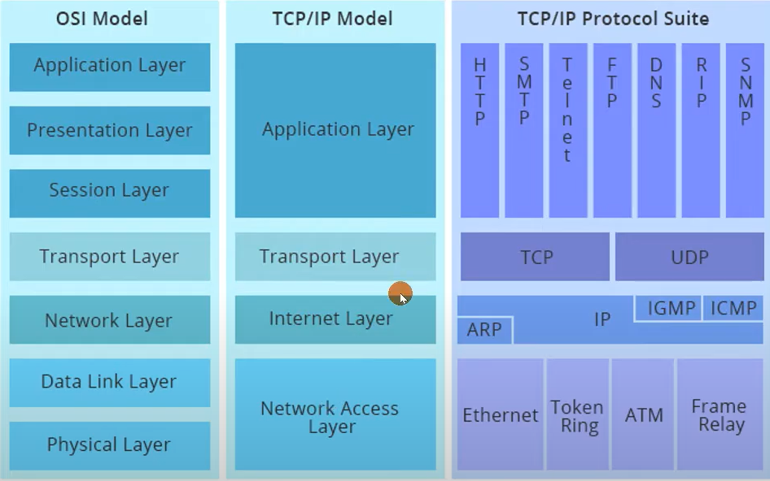

	* 和并了 7，6，5 层
	* 合并了 2，1 层

* 分层的好处
	* 封装
* 分层的坏处
	* 数据延迟，路径远
	* Inter 的 DBDK 可以绕过分层，但层内细节就没了
* 报文头部 6:42

	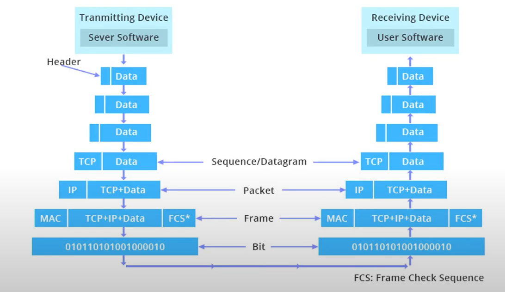

	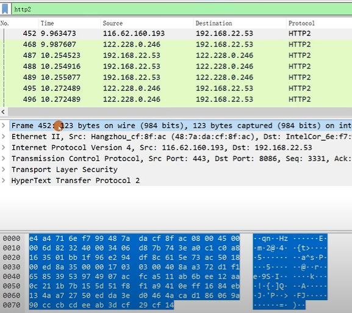

	* 这里的 Frame 不是数据链路层的 (Data Link: Ethernet) frame, 这里是 wireshark 自己定义的信息
	* Ethernet 2: 数据链路层 (MAC 地址)
	* IP 层
	* TCP 层
	* TLS 层会被加密
	* HTTP 2.0

## 06 HTTP 解决了什么问题？

* Form Follows Function: HTTP 协议为什么是现在这个样子？
	* HTTP 协议
		* Roy Thomas Fielding: HTTP 主要作者， REST 架构作者
	* URI: 统一资源标识符

		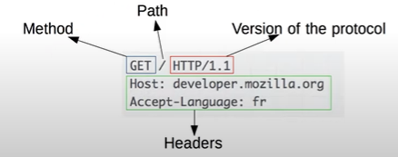

* HTTP 解决了什么问题？
	* Web's major goal was to be a shared information space through which ***people*** and ***machines*** could communicate. --Tim Berners Lee
	* 解决 WWW 信息交互必须面对的需求
		* 低门槛
		* 可扩展性
			* 巨大的用户群体，超长的寿命
		* 分布式系统下的 Hypermedia
			* 大粒度数据的网络传续
		* Internet 规模
			* 无法控制 scalability
				* 不可预测的负、非法格式的数据、恶意信息
				* 客户端不能保持所有服务器信息，服务器不能保持多个请求间的状态信息
			* 独立的组件部署：新老组件并存
		* 向前兼容： 自 1993 年起 HTTP0.9\1.0 （1996） 已经被广泛使用

## 07 评估 Web 架构的七大关键属性

* 评估 Web 架构的关键属性
	1. 性能 Performance: 影响高可用的关键因素
	2. 可伸缩性 Scalability: 支持部署可以以互相交换的大量组件
	3. 简单性 Simplicity: 易理解、易实现、易验证
	4. 可见性 Visibility: 对两个组件间的监护进行监视或者仲裁的能力。如缓存、分层设计等
	5. 可移植性 Portability: 在不同的环境下运行的能力
	6. 可靠性 Reliability: 出现部分故障时，对整体影响的程度
	7. 可修改行 Modifiability: 对系统作出修改的难易程度，由可进化性、可定制性、可扩展性、可配置性、可重用性构成
* 架构属性: 性能
	* 网络性能 Network Performance
		* Throughput 吞吐量: 小于等于带宽 bandwidth
		* Overhead 开销: 首次开销，每次开销
	* 用户感知到的性能 User-perceived Performance
		* Latency 延迟: 发起请求到接收到响应的时间
		* Completion 完成时间: 完成一个应用动作所花费的时间
	* 网络效率 Network Efficiency
			* 重用缓存、减少交互次数、数据传输距离更近、COD
* 架构属性: 可修改性
	* 可进化性 Evolvability: 一个组件独立升级而不影响其他组件
	* 可扩展性 Extensibility: 向系统添加功能，而不会影响到系统的其他部分
	* 可定制性 Customizability: 临时性、定制性地更改某一要素来提供服务，不对常规客户产生影响
	* 可配置性 Configurability: 应用部署后可通过修改配置提供新的功能
	* 可重用性 Reusability: 组件可以不做修改在其他应用再使用
* REST 架构下的 Web

	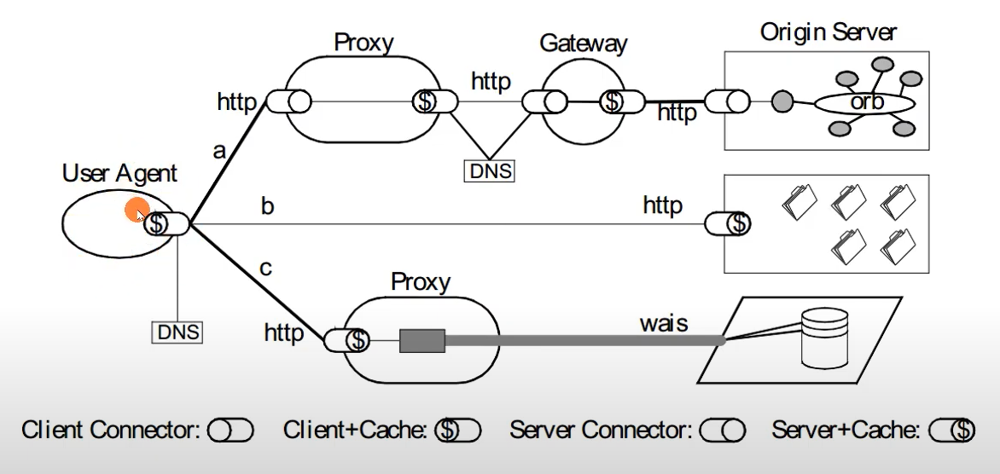

	* Proxy: 正向代理 (如: VPN)
	* Gateway: 反向代理

## 08 从五种架构风格推导出 HTTP 的 REST 架构

* 5 种架构风格
	* 数据流风格 Data-flow Styles
		* 优点：简单性、可进化性、可扩展性、可配置性、可重用性
		* 协议的分层，Nginx
	* 复制风格 Replication Styles
		* 优点：用户可察觉性、可伸缩性、网络效率、可靠性也可以得到提升
	* 分层风格 Hierarchical Styles
		* 优点：简单性、可进化性、可伸缩性
	* 移动代码风格 Mobile Code Styles
		* 优点：可移植性、可扩展性、网络效率
	* 点对点风格 Peer-to-Peer Styles
		* 优点：可进化性、可重用性、可扩展性、可配置性 
* 数据流风格 Data-flow Styles

	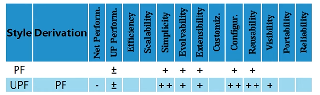

	* 管道与过滤器 Pipe And Filter, PF
		* 每个 Filter 都有输入端和输出端，只能从输入端读取数据，处理后再从输出端产生数据

		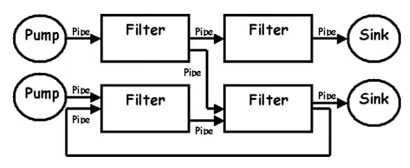

	* 统一接口的管道与过滤器 Uniform Pipe And Filter, UPF
		* 在 PF 上增加了统一接口的约束，所以 Filter 过滤器必须具备同样的接口

* 复制风格 Replication Styles

	

	* 复制仓库 Replicated Repository, RR
		* 多个进程提供相同的服务，通过反向代理对外提供集中服务
		* MySQL 冷热备份, Nginx 反向代理
	* 缓存 $
		* RR 的变体，通过复制请求的结果，为后序请求复用
		
		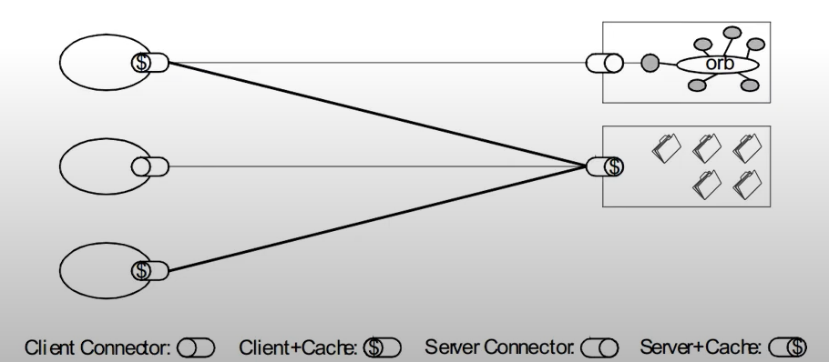

* 分层风格 Hierarchical Styles (一)

	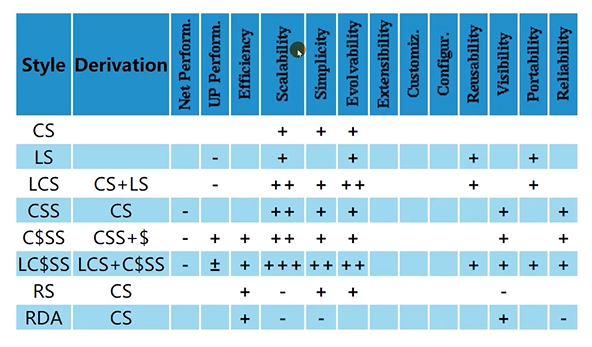

	* 客户端服务器 Client-Server, CS
		* 由 Client 触发请求，Server 监听到请求后产生响应，Client 一直等待收到响应后，会话结束
		* 分离关注点隐藏细节，良好的简单性、可伸缩性、可进化性
	* 分层系统 Layered System, Ls
		* 每一层为其之上的层服务，并使用在其之下的层所提供的服务，例如 TCP/IP
	* 分层客户端服务器 Layered Client-Server, LCS
		* LS + CS, 例如正向代理和反向代理，从空间上分为外部层和内部层
	* 无状态、客户端服务器 Client-Stateless-Server, CSS
		* 基于 CS，服务器上不允许由 session state 会话状态
		* 提上可可见性、可伸缩性、可靠性、但重复数据导致减低网络性能
	* 缓存、无状态、客户端服务器 Client-Cache-Stateless-Server, C$ss
		* 提升性能
	* 分层、缓存、无状态、客户端服务器 Layered-Client-Cache-Stateless-Server, LC$SS

		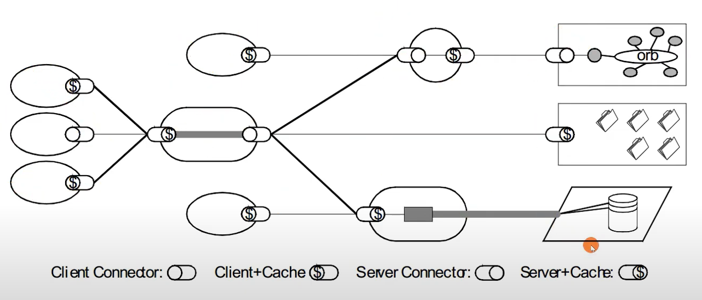

* 分层风格 Hierarchical Styles (二) REST 种没有使用
	* 远程会话 Remote Session, RS
		* CS 变体，服务器保存 Application state 应用状态
		* FTP
		* 可伸缩性、可见性差
	* 远程数据访问 Remote Data Access, RDA
		* CS 变体，Application state 应用状态同时分布在客户端与服务端
		* SQL 访问, 游标
		* 巨大的数据集可能通过跌点而减少
		* 简单性、可伸缩性差
* 移动代码风格 Mobile Code Styles

	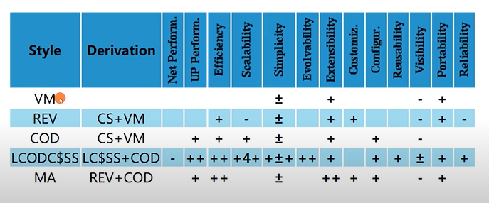

	* 要执行的代码可以任意的从客户端到服务器端移动
	* 虚拟机 Virtual Machine, VM
		* 分离指令与实现
		* 公有云, JVM
	* 远程求值 Remote Evaluation, REV
		* 基于 CS 的 VM，将代码发送至服务器执行
	* 按需代买 Code on Demand, COD
		* 服务器在响应中发回处理代买，在客户端执行
		* JS
		* 优秀的可扩展性和配置性，提升用户可察觉性能和网络效率
	*分层、按需代码、缓存、无状态、客户端服务器 Layered-Code-on-Demand-Client-Cache-Stateless-Server, LCODC$SS
		* LC$SS + COD
		* REST

		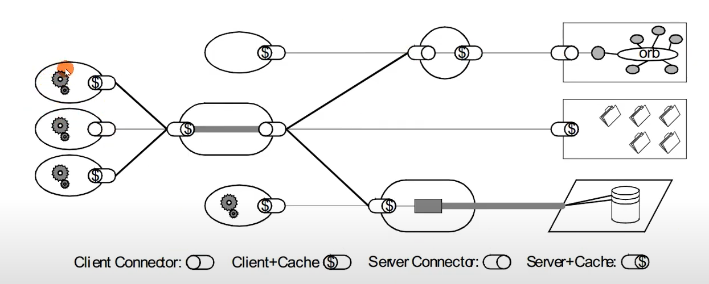

		* 齿轮代表可以执行代码

	* 移动代理 Mobile Agent, MA
		* 相当于 REV + COD
* 点对点风格 Peer-to-Peer Styles

	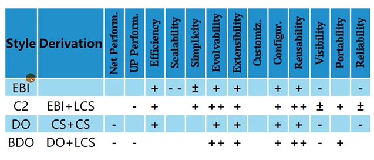

	* 都没有用在 REST 上
	* Event-based integration, EBI
		* 基于事件集成系统，如由类似 Kafka 这样的消息系统 + 分发订阅来消除耦合
		* 优秀的可重用性、可拓展性、可进化性
		* 缺乏可理解性
		* 由于信息广播等原因造成的消息风暴，可伸缩性差
	* Chiron-2, C2
		* 相当于 EBi+LCS, 控制了消息的方向
	* Distributed Objects: DO
		* 组件结对交互
	* Brokered Distributed  Objects, BDO
		引入名字解析组件来简化 DO，例如 DORBA
	

