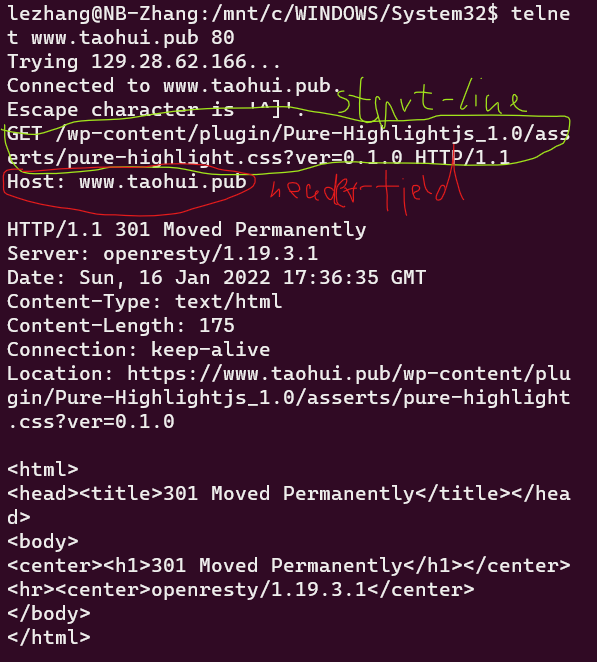
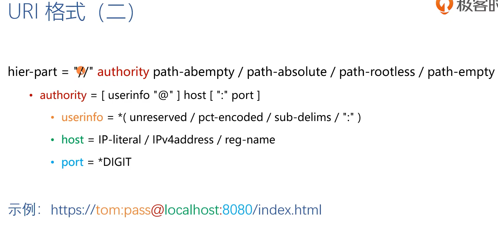
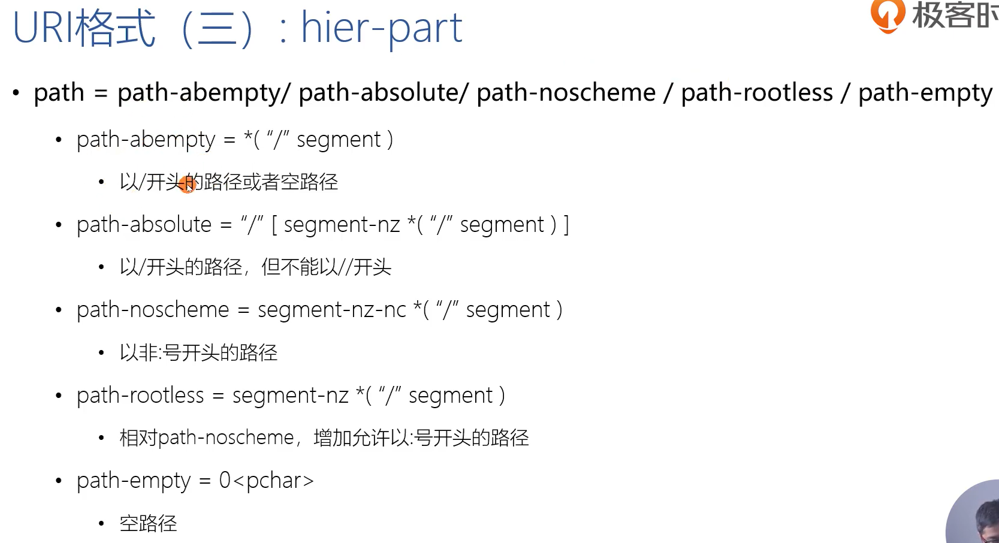
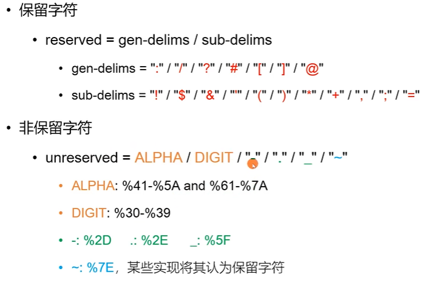
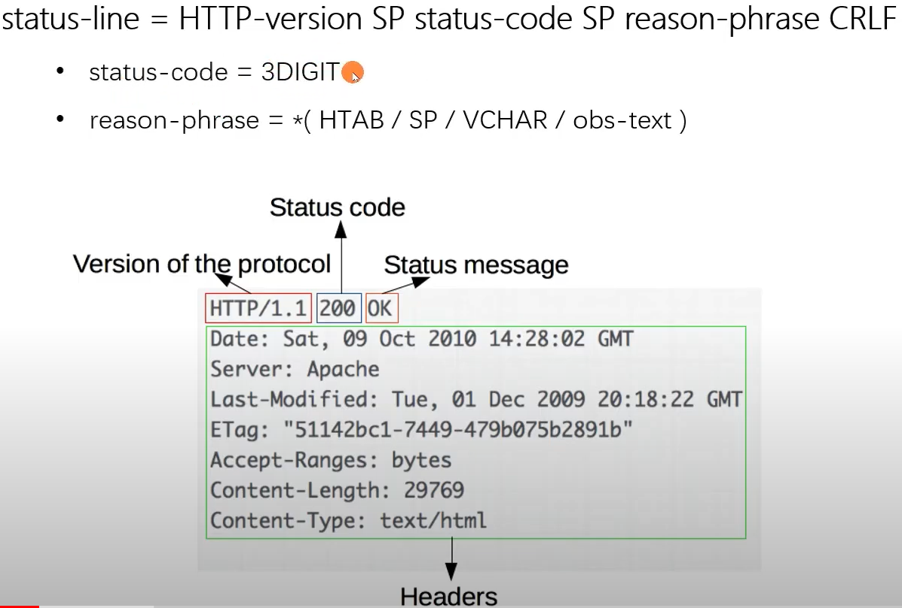

# HTTP

## 03 浏览器发起 HTTP 请求的场景

* 浏览器发起 HTTP 请求的场景

	

	

* Hypertext Transform Protocol (HTTP)

	a ***stateless*** (无状态协议，连续的两个请求中，后一个请求不能依赖前一个请求的字段或者头部等)

	application-level ***request/resonse*** (基于一个连接，由客户端发起请求，然后服务器才能在这个连接上发起一个响应)

	protocol that uses ***extensible semantics*** (语义是可扩展的，如果服务器只支持 1.0, 但浏览器支持 1.1，两者仍然可以正常通信)

	and ***self-descriptive** (子描述的消息，从请求中就知道这段消息是视频还是音频等，而不需要依赖其他的请求)

	message payloads of flexible interaction with network-based ***hypertext information*** (超文本系统，传输的不止有文档, 还有图片等)


	systems

	(RFC7230 2014.6)

## 04 基于 ABNF 语义定义的 HTTP 消息格式

* ABNF (扩充巴科斯-瑙尔范式) 操作符 (定义语法的元语言)
	* 空白字符：用来分隔定中的各个元素, 并不是表达描述的协议中有空白
		* method SP request-target SP HTTP-version CRLF
			* SP 是空格
			* SP 两边的空格不是
	* 选择 /: 表示多个规则都是可供选择的规则
		* start-line = request-line / status-line
	* 值范围 %c##-##:
		* OCTAL = "0" / "1" / "2" / "3" / "4" / "5" / "6" / "7" 与 OCTAL = %x30-37 (十六进制中的 30 到 37) 等价
	* 序列组合 (): 将规则组合起来，视为单个元素
	* 不定量重复 m*n
		* \* 元素表示零个或更多元素： *( header-field CRLF)
		* 1* 元素表示一个或更多元素， 2*4 元素表示两个至四个元素
	* 可选序列 [];
		* [ message-body ]
* ABNF 核心规则

	|规则|形式定义|意义|
	|-|-|-|
	|ALPHA|%x41-5A / %x61-7A|大写和小写 ASCII 字母 (A-Z, a-z)|
	|DIGIT|%x30-39|数字 (0 - 9)|
	|HEXDIG|DIGIT / "A" / "B" / "C" / "D" / "E" / "F"|十六进制数字 (0-9, A-F, a-f|
	|DQUOTE|%x22|双引号|
	|SP|%x22|空格|
	|HTAB|%x09|横向制表符|
	|WSP|SP / HTAB|空格或横向制表符|
	|LWSP|*(WSP/CRLF WSP)|直线空白（晚于换行）|
	|VCHAR|%x21-7E|可见（打印）字符|
	|CHAR|%x01-7F|任何7-位US-ASCII字符，不包含NUL (%x00)|
	|OCTET|%x00-FF/ %x7F|八位数据|
	|CTL|%x00-1F/ %x7F|控制字符|
	|CR|%x0D|回车|
	|LF|%x0A|换行|
	|CRLF|CRLF|互联网标准换行|
	|BIT|"0" / "1"|二进制数字|

* 基于 ABNF 描述的 HTTP 协议格式

HTTP-message = start-line *(header-filed CRLF) CRLF [ message-body ]
* start-line = request-line / status-line
	* request-line = method SP request-target SP HTTP-version CRLF
	* status-line = HTTP-version SP status-code SP reason-phrase CRLF
* header-field = field-name ":" OWS field-value OWS
	* OWS = *(SP / HTAB)
	* field-name = token
	* field-value = *(field-content / obs-fold)
* message-body = *OCTET
* 实验
	* telnet

		

	* Wireshark

## 05 网络为什么要分层： OSI 模型与 TCP IP 模型

* OSI (Open System Interconnection Reference Model) 概念模型

	

	```
	7. Application
		* 解决业务问题
	6. Presentation
		* 把网络中的消息，转换成应用层可以读取的格式 (TSL, SSL)
	5. Session (上下层都有延申的这里，只是个概念)
		* 建立会话，握手，维持连接关系
	4. Transport
		* 进程与进程之间的通信
			* 报文发到主机上，主机因该把报文分发给哪一个进程，由传输层来决定
		* 保证报文的可达性 (TCP)
		* 流量的控制 (TCP)
		* 负载均衡
	3. Network
		* 在广域网中，可以从一个主机上把报文发送到另外一个主机上 (IP)
	2. Data Link
		* 在局域网中，使用 MAC 地址连接到响应的交换机或者路由器
		* 二层设备
	1. Physical 
		* 物理介质
	```

* OSI 模型与 TCP/IP 模型对照

	

	* 和并了 7，6，5 层
	* 合并了 2，1 层

* 分层的好处
	* 封装
* 分层的坏处
	* 数据延迟，路径远
	* Inter 的 DBDK 可以绕过分层，但层内细节就没了
* 报文头部 6:42

	

	

	* 这里的 Frame 不是数据链路层的 (Data Link: Ethernet) frame, 这里是 wireshark 自己定义的信息
	* Ethernet 2: 数据链路层 (MAC 地址)
	* IP 层
	* TCP 层
	* TLS 层会被加密
	* HTTP 2.0

## 06 HTTP 解决了什么问题？

* Form Follows Function: HTTP 协议为什么是现在这个样子？
	* HTTP 协议
		* Roy Thomas Fielding: HTTP 主要作者， REST 架构作者
	* URI: 统一资源标识符

		

* HTTP 解决了什么问题？
	* Web's major goal was to be a shared information space through which ***people*** and ***machines*** could communicate. --Tim Berners Lee
	* 解决 WWW 信息交互必须面对的需求
		* 低门槛
		* 可扩展性
			* 巨大的用户群体，超长的寿命
		* 分布式系统下的 Hypermedia
			* 大粒度数据的网络传续
		* Internet 规模
			* 无法控制 scalability
				* 不可预测的负、非法格式的数据、恶意信息
				* 客户端不能保持所有服务器信息，服务器不能保持多个请求间的状态信息
			* 独立的组件部署：新老组件并存
		* 向前兼容： 自 1993 年起 HTTP0.9\1.0 （1996） 已经被广泛使用

## 07 评估 Web 架构的七大关键属性

* 评估 Web 架构的关键属性
	1. 性能 Performance: 影响高可用的关键因素
	2. 可伸缩性 Scalability: 支持部署可以以互相交换的大量组件
	3. 简单性 Simplicity: 易理解、易实现、易验证
	4. 可见性 Visibility: 对两个组件间的监护进行监视或者仲裁的能力。如缓存、分层设计等
	5. 可移植性 Portability: 在不同的环境下运行的能力
	6. 可靠性 Reliability: 出现部分故障时，对整体影响的程度
	7. 可修改行 Modifiability: 对系统作出修改的难易程度，由可进化性、可定制性、可扩展性、可配置性、可重用性构成
* 架构属性: 性能
	* 网络性能 Network Performance
		* Throughput 吞吐量: 小于等于带宽 bandwidth
		* Overhead 开销: 首次开销，每次开销
	* 用户感知到的性能 User-perceived Performance
		* Latency 延迟: 发起请求到接收到响应的时间
		* Completion 完成时间: 完成一个应用动作所花费的时间
	* 网络效率 Network Efficiency
			* 重用缓存、减少交互次数、数据传输距离更近、COD
* 架构属性: 可修改性
	* 可进化性 Evolvability: 一个组件独立升级而不影响其他组件
	* 可扩展性 Extensibility: 向系统添加功能，而不会影响到系统的其他部分
	* 可定制性 Customizability: 临时性、定制性地更改某一要素来提供服务，不对常规客户产生影响
	* 可配置性 Configurability: 应用部署后可通过修改配置提供新的功能
	* 可重用性 Reusability: 组件可以不做修改在其他应用再使用
* REST 架构下的 Web

	

	* Proxy: 正向代理 (如: VPN)
	* Gateway: 反向代理

## 08 从五种架构风格推导出 HTTP 的 REST 架构

* 5 种架构风格
	* 数据流风格 Data-flow Styles
		* 优点：简单性、可进化性、可扩展性、可配置性、可重用性
		* 协议的分层，Nginx
	* 复制风格 Replication Styles
		* 优点：用户可察觉性、可伸缩性、网络效率、可靠性也可以得到提升
	* 分层风格 Hierarchical Styles
		* 优点：简单性、可进化性、可伸缩性
	* 移动代码风格 Mobile Code Styles
		* 优点：可移植性、可扩展性、网络效率
	* 点对点风格 Peer-to-Peer Styles
		* 优点：可进化性、可重用性、可扩展性、可配置性 
* 数据流风格 Data-flow Styles

	

	* 管道与过滤器 Pipe And Filter, PF
		* 每个 Filter 都有输入端和输出端，只能从输入端读取数据，处理后再从输出端产生数据

		

	* 统一接口的管道与过滤器 Uniform Pipe And Filter, UPF
		* 在 PF 上增加了统一接口的约束，所以 Filter 过滤器必须具备同样的接口

* 复制风格 Replication Styles

	

	* 复制仓库 Replicated Repository, RR
		* 多个进程提供相同的服务，通过反向代理对外提供集中服务
		* MySQL 冷热备份, Nginx 反向代理
	* 缓存 $
		* RR 的变体，通过复制请求的结果，为后序请求复用
		
		

* 分层风格 Hierarchical Styles (一)

	

	* 客户端服务器 Client-Server, CS
		* 由 Client 触发请求，Server 监听到请求后产生响应，Client 一直等待收到响应后，会话结束
		* 分离关注点隐藏细节，良好的简单性、可伸缩性、可进化性
	* 分层系统 Layered System, Ls
		* 每一层为其之上的层服务，并使用在其之下的层所提供的服务，例如 TCP/IP
	* 分层客户端服务器 Layered Client-Server, LCS
		* LS + CS, 例如正向代理和反向代理，从空间上分为外部层和内部层
	* 无状态、客户端服务器 Client-Stateless-Server, CSS
		* 基于 CS，服务器上不允许由 session state 会话状态
		* 提上可可见性、可伸缩性、可靠性、但重复数据导致减低网络性能
	* 缓存、无状态、客户端服务器 Client-Cache-Stateless-Server, C$ss
		* 提升性能
	* 分层、缓存、无状态、客户端服务器 Layered-Client-Cache-Stateless-Server, LC$SS

		

* 分层风格 Hierarchical Styles (二) REST 种没有使用
	* 远程会话 Remote Session, RS
		* CS 变体，服务器保存 Application state 应用状态
		* FTP
		* 可伸缩性、可见性差
	* 远程数据访问 Remote Data Access, RDA
		* CS 变体，Application state 应用状态同时分布在客户端与服务端
		* SQL 访问, 游标
		* 巨大的数据集可能通过跌点而减少
		* 简单性、可伸缩性差
* 移动代码风格 Mobile Code Styles

	

	* 要执行的代码可以任意的从客户端到服务器端移动
	* 虚拟机 Virtual Machine, VM
		* 分离指令与实现
		* 公有云, JVM
	* 远程求值 Remote Evaluation, REV
		* 基于 CS 的 VM，将代码发送至服务器执行
	* 按需代买 Code on Demand, COD
		* 服务器在响应中发回处理代买，在客户端执行
		* JS
		* 优秀的可扩展性和配置性，提升用户可察觉性能和网络效率
	*分层、按需代码、缓存、无状态、客户端服务器 Layered-Code-on-Demand-Client-Cache-Stateless-Server, LCODC$SS
		* LC$SS + COD
		* REST

		

		* 齿轮代表可以执行代码

	* 移动代理 Mobile Agent, MA
		* 相当于 REV + COD
* 点对点风格 Peer-to-Peer Styles

	

	* 都没有用在 REST 上
	* Event-based integration, EBI
		* 基于事件集成系统，如由类似 Kafka 这样的消息系统 + 分发订阅来消除耦合
		* 优秀的可重用性、可拓展性、可进化性
		* 缺乏可理解性
		* 由于信息广播等原因造成的消息风暴，可伸缩性差
	* Chiron-2, C2
		* 相当于 EBi+LCS, 控制了消息的方向
	* Distributed Objects: DO
		* 组件结对交互
	* Brokered Distributed  Objects, BDO
		引入名字解析组件来简化 DO，例如 DORBA
	


## 09 如何用 Chrome 的 Network 面板分析 HTTP 报文

* Chrome 抓包：快速定位 HTTP 协议问题
	* 过滤器 (空格实现 AND 选择)
		* domain:
		* has-response-header:
		* is:
			* is: running
			* is: from-cache
		* larger-than:
		* method:
			* GET, POST, ...
		* mime-type
		* scheme:
			* HTTP | HTTPS
		* set-cookie-domain:
		* set-cookie-name:
		* set-cookie-value:
		* status-code:
		* ...
	* 请求列表
		* Name
		* Status
		* Type
		* initiator:
			* Parser
			* Redirect
			* Script
			* Other
				* 点击
		* Size
		* Time
		* Waterfall: 分析图
	* 预览请求内容
		* 浏览器加载使时间
		* 查看请求上下游:
			* Shift 悬停请求上，绿色是上游，红色是下游
* 浏览器加载时间
	* 触发流程：
		* 解析 HTML 结构
		* 加载外部脚本和样式表文件
		* 解析并执行脚本代码 // 部分脚本会阻塞页面的加载
		* DOM 树构建完成 // DOMContentLoaded 事件
		* 加载图片等外部文件 // load 事件
	* 请求时间详细分布
		* Queueing: 浏览器在一下情况对请求排队
			* 存在更高优先级的请求
			* 此源已经带开了六个 TCP 连接，达到限值，仅适用于 HTTP/1.0 和 HTTP/1.1
			* 浏览器正在短暂分配磁盘缓存中的空间
		* Stalled: 请求可能会因为 Queueing 描述的任何原因而停止
		* DNS Lookup: 浏览器正在解析请求的 IP 地址
		* Proxy Negotiation: 浏览器正在与代理服务器协商请求
		* Request sent: 正在发送请求
		* ServiceWorker Preparation: 浏览器正在启动 Service Worker (负责网络的进程)
		* Request to ServiceWorker: 正在将请求发送到 Service Worker
		* Waiting (TTFB): 浏览器正在等待响应的第一个字节。 TTFB 表示 Time To First Byte。此时间包括 1 次往返延迟时间及服务器转杯响应所用的时间
		* Content Download: 浏览器正在接收响应
		* Receiving Push: 浏览器正在通过 HTTP/2 服务器推送接收此响应的数据
		* Reading Push: 浏览器正在读取之前收到的本地数据

## 10 URI 的基本格式以及 URL 的区别

* 什么是 URI
	* URL: Uniform Resource Locator, 表示资源的位置，期望提供资源的查找方法
	* URN: Uniform Resource Name, 期望为支援提供持久的、位置无关的表示方式，并允许检点的将多个命名空间映射到单个 URN 命名空间
	* URI: Uniform Resource Identifier, 用以区分资源，是 URL 和 URN 的超集，用于取代 URL 和 URN 的概念
* URI 的组成
	* schema
	* user information
	* host
	* port
		* 默认是 80 端口
		* https 默认是 43 端口
	* path
	* query
	* fragment

	

* URI 格式

	

	

	

* 相对 URI

	

## 11 为什么要对 URI 进行编码？

* 传递数据中，如果存在用作分隔符的保留字符怎么办？
* 对可能产生歧义性的数据编码
	* 不在 ASCII 码范围内的字符
	* ASCII 码种不可显示的的字符
	* URI 中规定的保留字符
	* 不安全字符 (传输环节可能会被不正当处理)，如空格、引号、尖括号等
* 示例
	* https://www.baidu.com/s?wd=?#!
	* https://www.baidu.com/s?wd=极客 时间
	* https://www.baidu.com/s?wd=极客 '>时间
* 保留字符与非保留字符

	

* URI 百分号编码

	

## 12 详解 HTTP 的请求行

* 请求行 (一)
	* request-line = method SP request-target SP HTTP-version CRLF

		

		* method 方法: 指明操作目的，动词
* 请求行（二）
	* request-target = origin-form / absolute-form / authority-form / asterisk-form (四种格式)
		* origin-form = absolute-path ["?" query] (向产生内容的服务器发起请求)
			* 向 origin server 发起的请求，path 为空时必须传递 /
		* absolute-form = absolute-URI
			* 仅用于向正向代理 proxy 发起请求时，详见正向代理与隧道
		* authority-form = authority
			* 仅用于 CONNECT 方法，例如 CONNECT www.example.com:80 HTTP/1.1
		* asterisk-form = "*"
			* 仅用于 OPTIONS 方法
* 常用方法 (RFC7231)
	* GET
	* HEAD
	* POST
	* PUT: 更新资源，带条件时时幂等方法
	* DELETE
	* CONNECT: 建立 tunnel 隧道
	* OPTIONS: 显示服务器对访问资源支持的方法, 幂

		

	* TRACE: 回显服务器收到的请求，用于定位问题，又安全风险
		* 从 nginx 0.5.17 (2007) 开始返回 405
* 用于文档管理的 WEBDEV 方法 （RFC2518）：
	* 作用
		* 有助于 Restfull API
		* 多人协作文件管理
	* PROPFIND: 从 Web 资源中检索以 XML 格式储存的属性。它也被重载，以允许一个检索远程系统的集合结构（也叫目录层次结构）
	* PROPPATCH： 在单个原子性动作中更改和删除资源的多个属性
	* MKCOL: 创建集合或者目录
	* COPY： 将资源从一个 URI 复制到另一个 URI
	* MOVE： 将资源从一个 URI 移动到另一个 URI
	* LOCK: 锁定一个资源。 WebDAV 支持共享锁和互斥锁
	* UNLOCK: 解除资源的锁定
	* WEBDAV 实验
		* 环境
			* 服务器
				* Nginx
				* http_dav_module 模块
				* nginx-dav-ext-module 模块
			* 客户端
				* winscp
		* 过程
			* 创建 Wireshark 捕获

				

			* 用客户端连接服务器

				

			* 在客户端中修改服务器上的文件
			* 分析抓取的报文

				

## 13 HTTP 的正确响应码

* 响应行

	

* 响应码
	* 1xx：请求已接收到，需要金鱼不处理才能完成，HTTP1.0 不支持
		* 100 Continue: 上传大文件前使用
			* 由客户端还请请求中携带 Expect: 100-continue 头部触发

				

		* 101 Switch Protocols: 协议升级使用
			* 由客户端发起请求中携带 Upgrade: 头部触发，如升级 websocket 或者 http/2.0
		* 102 Processing: WebDEV 请求可能包含许多涉及文件操作的子请求，需要很长时间才能完成请求。该代码表似服务器已经收到并正在处理请求，但无响应可用。这样可以防止客户端超时，并假设请求丢失。
	* 2xx: 成功和处理请求
		* 200 OK: 成功返回响应。
		* 201 Created: 由新资源在服务器端被成功创建 
		* 202 Accepted: 服务器接收并开始处理请求，但请求未处理完成。这样以一个模糊的概念是有意如此设计，可以覆盖更多的场景。例如异步，需要长时间处理的任务
		* 203 Non-Authoritative Information: 当代理服务器修改了 origin server 的原始响应包体时（例如更换了 HTML 中的元素值），代理服务器可以通过修改 200 为 203 的方式告诉客户端这一事实，方便客户端为这一行为做出响应的处理。203 响应可以被缓存。203 其实并不被广为接收
		* 204 No Content: 成功执行了请求且不携带响应胞体，并暗示客户端无需更新当前的页面视图。常见于用 PUT，POST 上传了一些资源，但是返回响应不需要刷新
		* 205 Reset Content: 成功执行了请求且不携带响应胞体，同时指明客户端需要更新当前页面
		* 206 Partial Content: 使用 range 协议时返回部分响应内容时的响应码。用于多线程断链续传下载
		* 207 Multi-Status: 在 WEBDEV 协议中以 XML 返回多个资源状态。比如请求一个目录，总体是 207，但子目录有自己的返回码
		* 208 Already Reported: 为避免相同集合下资源在 207 响应码下重复上报，使用 208 可以使用父集合的响应码
	* 3xx: 重定向使用 Location 指向的资源或者缓存中的资源。在 RFC2068 中规定客户端重定向次数不能超过 5 次，以防止死循环。
		* 300 Multiple Choices: 资源有错中表述，通过 300 返回给客户端后由其自行选择访问哪一种表述。由于缺乏明确的细节，300 很少使用。
		* 301 Moved Permanently: 资源永久性的重定向到另一个 URI 中。
		* 302 Found: 资源临时的重定向到另一个 URI 中
		* 303 See Other: 重定向到其他资源，常用于 PoST/PUT 等方法的响应中
		* 304 Not Modified: 当客户端拥有可能过的的缓存时，会携带缓存的标识 etag、时间等信息询问服务器缓存是否仍可复用，而 304 时告诉客户端可以复用缓存
		* 307 Temporary Redirect: 类似 302，但明确重定向后请求方法必须于原请求方法相同，不得改变
		308 Permanent Redirect: 类似 301，但明确重定向后请求方法必须与原请求方法相同，不得改变

## 14 HTTP 的错误响应码

* 响应码
	* 4xx: 客户端出现错误
		* 400 Bad Request: 服务器认为客户端出现了错误，但不能明确判断以下哪种错误时使用次错误码。例如 HTTP 请求格式错误。
		* 401 Unauthorized: 用户认证信息确实或者不正确，导致服务器无法处理请求
		* 407 Proxy Authentication Required: 对需要经由代理的请求，认证信息为通过代理服务器的验证
		* 403 Forbidden: 服务器理解请求的含义，但没有权限执行此请求
			* 常见于搭建了服务器，但对某个目录下的文件没有访问权限
		* 404 Not Found: 服务器没有找到对应的资源
		* 410 Gone: 服务器没有找到对应的资源，且明确的知道该位置永久性找不到该资源, 很少使用
		* 405 Method Not Allowed: 服务器不支持请求行中的 method 方法

			

		* 406 Not Acceptable: 对客户端指定的资源描述不存在（例如对语言或者编码由要求），服务器返回表述别表供客户端选择
		* 408 Request Timeout: 服务器请求超时
		* 409 Conflict: 资源冲突，例如上传文件时目标位置已经存在版本更新的资源
		* 411 Length Request: 如果请求含有包体且未携带 Content-Length 头部，且不属于 chunk 类请求时，返回 411
		* 412 Precondition Failed: 复用缓存时传递的 If-Unmodified-Since 或 If-None-Match 头部不满足
		* 413 Payload Too Large/Request Entity Too Large: 请求的胞体超出服务器能处理的最大长度
		* 414 URI Too Long
		* 415 Unsupported Media Type: MIME 类型不被支持
		* 416 Range Not Satisfiable: 无法提供 Range 请求中指定的那段包体
		* 417 Expectation Failed: 对于 Expect 请求头部期待的情况无法满足时的响应码
		* 421 Misdirected Request
		* 426 Upgrade Required
		* 428 Precondition Required
		* 429 Too Many Requests: 客户端发送请求的速度过快
		* 431 Request Header Fields Too Large: 通常返回 414
		* 451 Unavailable for legal Reasons
	* 5xx: 服务器端出现的错误
		* 500 Internal Server Error
		* 501 Not Implemented
		* 502 Bad Gateway: 代理服务器无法获取到合法响应
		* 503 Service Unavailable: 服务器资源尚未准备好处理当前请求
		* 504 Gateway Timeout: 代理服务器无法及时的从上游获得响应
		* 505 HTTP Version Not Supported
		* 507 Insufficient Storage: 服务器没有足够的空间处理请求
		* 508 Loop Detected: 访问资源时检测到循环
		* 511 Network Authentication Required: 代理服务器发现客户端需要进行身份验证才能获得网络访问权限  
	* 客户端不认识的返回码会被当做 x00 来处理

## 15 如何管理跨代理服务器的长短连接

* HTTP 连接的常见流程 (短链接)

	

* 从 TCP 编程上看 HTTP 请求处理

	

* 短连接与长连接
	* 事务: 一次请求和响应的合称
	* 短链接 vs 长连接

		

		* 老的服务器不支持长连接
	* 长短连接由 Connection 头部决定
		* Keep-Alive: 长连接
			* 客户端请求长连接
				* Connection: Keep-Alive
			* 服务器表示支持长连接
				* Connection: Keep-Alive
			* 客户端复用连接
			* HTTP/1.1 默认支持长连接
				* Connection: Keep-Alive 无意义
				* Connection: Close 短连接
		* 对代理服务器的要求
			* 不转发 Connection 列出的头部，该头部仅与当前连接相关
* Connection 仅针对当前连接有效
	* user agent 与 origin server 间有层层 proxy 代理

		

		* 虽然客户端要求长连接，但服务器可以表示不支持，只能短连接
* 代理服务器对长连接的支持
	* 代理服务器过去陈旧，不支持长连接，也不认识 Connection 头部，会原方转发，此时客户端和原服务器都以为与代理服务器是长连接，但代理服务器只支持短连接

		

	* 解决方法 Proxy-Connection 头部

		* 浏览器还不知道要连接代理服务器，没有 proxyConnection 头部
  
		

		* 打开代理服务

		

		* 替换为 proxyConnection

		

## 16 HTTP 消息在服务端的路由

* Host 头部
	* Host = uri-host[":"port]
	* 必须且唯一且合法，否则返回 400
* Host 头部与信息的路由

	